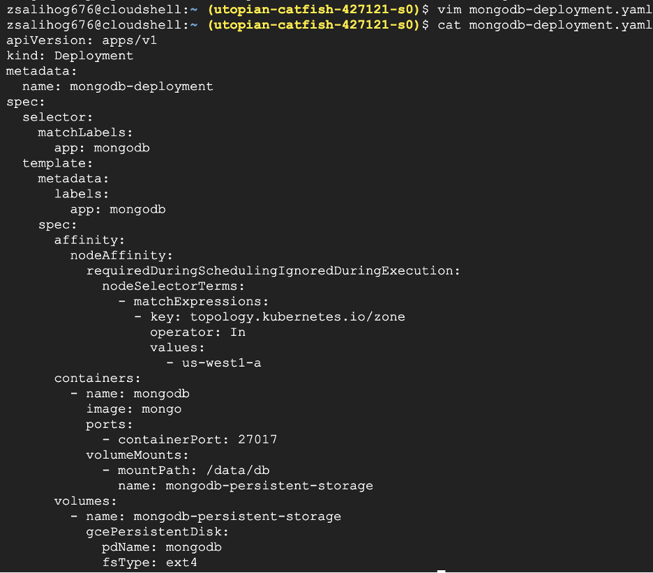

# Configmap-Signature-Project-MongoDB-Python-Flask-Web-Framework-REST-API-GKE

---

## Overview

This project involves deploying a MongoDB database and a Python Flask web framework application on Google Kubernetes Engine (GKE). It also includes creating a REST API and configuring Ingress with Nginx to expose the applications.

## Prerequisites

- Google Cloud SDK (`gcloud`)
- Kubernetes command-line tool (`kubectl`)
- Docker
- Minikube (for local Kubernetes testing)
- Access to Docker Hub

## Steps

### Step 1: Create MongoDB Using Persistent Volume on GKE

1. **Create a GKE Cluster**

   ```bash
   gcloud container clusters create kubia --num-nodes=1 --machine-type=e2-micro --region=us-west1
   ```

2. **Create a Persistent Volume**

   ```bash
   gcloud compute disks create --size=10GiB --zone=us-west1-a mongodb
   ```

3. **Create MongoDB Deployment**

   Create `mongodb-deployment.yaml` and apply it:

   ```yaml
   # mongodb-deployment.yaml content here
   ```



   ```bash
   kubectl apply -f mongodb-deployment.yaml
   ```

4. **Check Pods**

   ```bash
   kubectl get pods
   ```

5. **Create MongoDB Service**

   Create `mongodb-service.yaml` and apply it:

   ```yaml
   # mongodb-service.yaml content here
   ```


   ```bash
   kubectl apply -f mongodb-service.yaml
   ```

6. **Check Service**

   ```bash
   kubectl get svc
   ```

7. **Verify MongoDB Connection**

   ```bash
   kubectl exec -it mongodb-deployment-<pod-name> -- mongosh
   ```

   Install `mongosh` if necessary:

   ```bash
   wget https://downloads.mongodb.com/compass/mongosh-1.10.1-linux-x64.tgz
   tar -zxvf mongosh-1.10.1-linux-x64.tgz
   sudo cp mongosh-1.10.1-linux-x64/bin/mongosh /usr/local/bin/
   mongosh --version
   ```

   Connect to MongoDB:

   ```bash
   mongosh mongodb://<External-IP>:27017
   ```

8. **Insert Records into MongoDB**

   Use the following Node.js script:

   ```js
   const { MongoClient } = require('mongodb');
   
   // Use the provided external IP address
   const url = "mongodb://34.19.13.159:27017/mydb";
   
   async function run() {
       let client;
   
       try {
           // Connect to the database
           client = await MongoClient.connect(url);
           console.log("Connected to MongoDB");
   
           // Select the database
           const db = client.db("studentdb");
   
           // Create documents to be inserted
           const docs = [
               { student_id: 11111, student_name: "Bruce Lee", grade: 84 },
               { student_id: 22222, student_name: "Jackie Chen", grade: 93 },
               { student_id: 33333, student_name: "Jet Li", grade: 88 }
           ];
   
           // Insert documents into the collection
           const insertResult = await db.collection("students").insertMany(docs);
           console.log('Number of documents inserted:', insertResult.insertedCount);
   
           // Query for a specific document
           const result = await db.collection("students").findOne({ student_id: 11111 });
           console.log('Found document:', result);
   
       } catch (err) {
           console.error('Error:', err);
       } finally {
           // Close the connection
           if (client) {
               await client.close();
           }
       }
   }
   
   run();
   
   ```

### Step 2: Modify and Deploy StudentServer

1. **Create `studentServer.js`**

   ```js
   var http = require('http');
   var url = require('url');
   var mongodb = require('mongodb');
   const {
       MONGO_URL,
       MONGO_DATABASE
   } = process.env;
   
   // - Expect the request to contain a query
   // string with a key 'student_id' and a student ID as
   // the value. For example
   // /api/score?student_id=1111
   // - The JSON response should contain only 'student_id', 'student_name'
   // and 'student_score' properties. For example:
   //
   // {
   // "student_id": 1111,
   // "student_name": Bruce Lee,
   // "student_score": 84
   // }
   
   var MongoClient = mongodb.MongoClient;
   var uri = `mongodb://${MONGO_URL}/${MONGO_DATABASE}`;
   
   // Connect to the db
   console.log(uri);
   var server = http.createServer(function (req, res) {
       var result;
       // req.url = /api/score?student_id=11111
       var parsedUrl = url.parse(req.url, true);
       var student_id = parseInt(parsedUrl.query.student_id);
   
       // match req.url with the string /api/score
       if (/^\/api\/score/.test(req.url)) {
           // e.g., of student_id 1111
           MongoClient.connect(uri, { useNewUrlParser: true, useUnifiedTopology: true }, function(err, client) {
               if (err) throw err;
               var db = client.db("studentdb");
               db.collection("students").findOne({ "student_id": student_id }, function(err, student) {
                   if (err) throw new Error(err.message, null);
                   if (student) {
                       res.writeHead(200, { 'Content-Type': 'application/json' });
                       res.end(JSON.stringify(student) + '\n');
                   } else {
                       res.writeHead(404);
                       res.end("Student Not Found \n");
                   }
                   client.close();
               });
           });
       } else {
           res.writeHead(404);
           res.end("Wrong url, please try again\n");
       }
   });
   server.listen(8080);
   
   ```

2. **Create Dockerfile**

   ```Dockerfile
   # Use an official Node.js runtime as a parent image
   FROM node:18
   
   # Set the working directory in the container
   WORKDIR /app
   
   # Copy package.json and package-lock.json
   COPY package*.json ./
   
   # Install the dependencies
   RUN npm install
   
   # Copy the rest of the application code
   COPY studentServer.js .
   
   # Run the application
   CMD ["node", "studentServer.js"]
   
   ```

3. **Build Docker Image**

   ```bash
   docker build -t zeynepsalihoglu99/student-server .
   ```

4. **Push Docker Image**

   ```bash
   docker push zeynepsalihoglu99/student-server
   ```

### Step 3: Create and Deploy Python Flask Bookshelf REST API

1. **Create `bookshelf.py`**

   ```python
   from flask import Flask, request, jsonify
   from flask_pymongo import PyMongo
   from bson.objectid import ObjectId
   import socket
   import os
   
   app = Flask(__name__)
   app.config["MONGO_URI"] = "mongodb://" + os.getenv("MONGO_URL") + "/" + os.getenv("MONGO_DATABASE")
   app.config['JSONIFY_PRETTYPRINT_REGULAR'] = True
   
   mongo = PyMongo(app)
   db = mongo.db
   
   @app.route("/")
   def index():
       hostname = socket.gethostname()
       return jsonify(
           message="Welcome to bookshelf app! I am running inside {} pod!".format(hostname)
       )
   
   @app.route("/books")
   def get_all_books():
       books = db.bookshelf.find()
       data = []
       for book in books:
           data.append({
               "id": str(book["_id"]),
               "Book Name": book["book_name"],
               "Book Author": book["book_author"],
               "ISBN": book["ISBN"]
           })
       return jsonify(data)
   
   @app.route("/book", methods=["POST"])
   def add_book():
       book = request.get_json(force=True)
       db.bookshelf.insert_one({
           "book_name": book["book_name"],
           "book_author": book["book_author"],
           "ISBN": book["ISBN"]
       })
       return jsonify(message="Book saved successfully!")
   
   @app.route("/book/<id>", methods=["PUT"])
   def update_book(id):
       data = request.get_json(force=True)
       response = db.bookshelf.update_many(
           {"_id": ObjectId(id)},
           {"$set": {
               "book_name": data['book_name'],
               "book_author": data["book_author"],
               "ISBN": data["ISBN"]
           }}
       )
       if response.matched_count:
           message = "Book updated successfully!"
       else:
           message = "No book found!"
       return jsonify(message=message)
   
   @app.route("/book/<id>", methods=["DELETE"])
   def delete_book(id):
       response = db.bookshelf.delete_one({"_id": ObjectId(id)})
       if response.deleted_count:
           message = "Book deleted successfully!"
       else:
           message = "No book found!"
       return jsonify(message=message)
   
   @app.route("/books/delete", methods=["POST"])
   def delete_all_books():
       db.bookshelf.delete_many({})
       return jsonify(message="All books deleted!")
   
   if __name__ == "__main__":
       app.run(host="0.0.0.0", port=5000)
   
   ```

2. **Create Dockerfile**

   ```Dockerfile
   FROM python:alpine3.7
   
   # Set environment variables
   ENV PORT=5000
   
   # Create and set working directory
   WORKDIR /app
   
   # Copy the application code and requirements file to the container
   COPY . /app
   
   # Install the dependencies
   RUN pip install --no-cache-dir -r requirements.txt
   
   # Expose the port the app runs on
   EXPOSE 5000
   
   # Specify the command to run on container start
   ENTRYPOINT ["python3"]
   CMD ["bookshelf.py"]
   
   ```

3. **Create `requirements.txt`**

   ```txt
   Flask==2.2.2
   Flask-PyMongo==2.3.0
   pymongo==4.1.1
   ```

4. **Build Docker Image**

   ```bash
   docker build -t zeynepsalihoglu99/bookshelf .
   ```

5. **Push Docker Image**

   ```bash
   docker push zeynepsalihoglu99/bookshelf
   ```

### Step 4: Create ConfigMap for Applications

1. **Create `studentserver-configmap.yaml`**

   ```yaml
   apiVersion: v1
   kind: ConfigMap
   metadata:
     name: studentserver-config
   data:
     MONGO_URL: "<your-external-ip>"
     MONGO_DATABASE: "mydb"
   
   ```

2. **Create `bookshelf-configmap.yaml`**

   ```yaml
   apiVersion: v1
   kind: ConfigMap
   metadata:
     name: bookshelf-config
   data:
     # SERVICE_NAME.NAMESPACE.svc.cluster.local:SERVICE_PORT
     MONGO_URL: "<your-external-ip>"
     MONGO_DATABASE: "mydb"
   
   ```

### Step 5: Expose Applications Using Ingress with Nginx

1. **Create Deployments and Services**

   Create and apply the following YAML files:

   - `studentserver-deployment.yaml`
   ```yaml
   apiVersion: apps/v1
   kind: Deployment
   metadata:
     name: web
     labels:
       app: studentserver-deploy
   spec:
     replicas: 1
     selector:
       matchLabels:
         app: web
     template:
       metadata:
         labels:
           app: web
       spec:
         containers:
           - image: zeynepsalihoglu99/student-server
             imagePullPolicy: Always
             name: web
             ports:
               - containerPort: 8080
             env:
               - name: MONGO_URL
                 valueFrom:
                   configMapKeyRef:
                     name: studentserver-config
                     key: MONGO_URL
               - name: MONGO_DATABASE
                 valueFrom:
                   configMapKeyRef:
                     name: studentserver-config
                     key: MONGO_DATABASE
   ```
   - `bookshelf-deployment.yaml`
   ```yaml
   apiVersion: apps/v1
   kind: Deployment
   metadata:
     name: bookshelf-deployment
     labels:
       app: bookshelf-deployment
   spec:
     replicas: 1
     selector:
       matchLabels:
         app: bookshelf-deployment
     template:
       metadata:
         labels:
           app: bookshelf-deployment
       spec:
         containers:
           - image: zeynepsalihoglu99/bookshelf
             imagePullPolicy: Always
             name: bookshelf-deployment
             ports:
               - containerPort: 5000
             env:
               - name: MONGO_URL
                 valueFrom:
                   configMapKeyRef:
                     name: bookshelf-config
                     key: MONGO_URL
               - name: MONGO_DATABASE
                 valueFrom:
                   configMapKeyRef:
                     name: bookshelf-config
                     key: MONGO_DATABASE
   ```
   - `studentserver-service.yaml`
   ```yaml
   apiVersion: v1
   kind: Service
   metadata:
     name: web
   spec:
     type: LoadBalancer
     ports:
       - port: 8080
         targetPort: 8080
     selector:
       app: web
   ```
   - `bookshelf-service.yaml`
   ```yaml
   apiVersion: v1
   kind: Service
   metadata:
     name: bookshelf-service
   spec:
     type: LoadBalancer
     ports:
       - port: 5000
         targetPort: 5000
     selector:
       app: bookshelf-deployment
   ```

2. **Start Minikube**

   ```bash
   minikube start
   ```

3. **Enable Ingress**

   ```bash
   minikube addons enable ingress
   ```

4. **Apply Ingress Configuration**

   Create `studentservermongoIngress.yaml`:

   ```yaml
   apiVersion: networking.k8s.io/v1
   kind: Ingress
   metadata:
     name: server
     annotations:
       nginx.ingress.kubernetes.io/rewrite-target: /$2
   spec:
     rules:
       - host: cs571.project.com
         http:
           paths:
             - path: /studentserver(/|$)(.*)
               pathType: Prefix
               backend:
                 service:
                   name: web
                   port:
                     number: 8080
             - path: /bookshelf(/|$)(.*)
               pathType: Prefix
               backend:
                 service:
                   name: bookshelf-service
                   port:
                     number: 5000
   ```

   Apply it:

   ```bash
   kubectl apply -f studentservermongoIngress.yaml
   ```

5. **Check Ingress Status**

   ```bash
   kubectl get ingress
   ```

6. **Update `/etc/hosts`**

   Add the address to `/etc/hosts`:

   ```txt
   <Ingress-IP> cs571.project.com
   ```

7. **Test Access**

   ```bash
   curl cs571.project.com/studentserver/api/score?student_id=11111
   curl cs571.project.com/bookshelf/books
   ```

---
